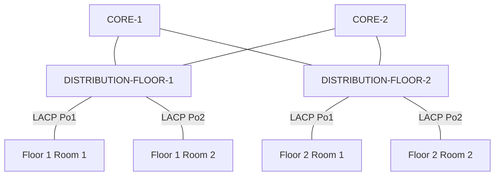

# Three-Tier Cisco Campus Network Lab

A Cisco Packet Tracer project modeling a two-floor campus with separate access, distribution, and core layers. Each room has an access switch; each floor has a multilayer distribution switch; two multilayer core switches connect the floor networks over routed links.

I built the switching and routing infrastructure, configured DHCP services for PCs and IP phones, and tested an extended ACL against guest traffic. The project records the network design, configuration captures, verification results, and troubleshooting decisions.

**Environment:** Cisco Packet Tracer simulation. **Latest documented build:** September 29, 2026.

## Design inspiration

The design follows Cisco's hierarchical campus network model: **access, distribution, and core**. Cisco describes these as the traditional three tiers of a campus network in [Enterprise Campus 3.0 Architecture: Overview and Framework](https://www.cisco.com/c/en/us/td/docs/solutions/Enterprise/Campus/campover.html).

This project adapts that model to a two-floor lab. The specific topology, VLANs, addressing, routing, and traffic policies were developed for this project rather than copied from a Cisco reference topology.

## Topology

Room switches connect PCs and phones through Layer 2 access ports. Distribution switches provide the VLAN gateway SVIs, DHCP relay, and inter-VLAN routing. Both distributions connect to both cores through separate routed /30 links; OSPF exchanges the floor routes. Each floor has a DHCP server in its server VLAN.

The screenshot also shows access points and two additional, unconnected distribution switches. The unconnected switches represent the planned backup distribution devices; they are not part of the working forwarding topology. Canvas labels such as `CORE-FLOOR 1` identify the two core devices; the normalized names above clarify their roles.

## Implementation

| Area | Implementation |
| --- | --- |
| VLAN segmentation | VLAN 10 USERS, 20 VOICE, 30 SERVERS, 45 GUEST, and 99 MGMT |
| Access uplinks | Separate three-member LACP EtherChannels for each room; Po1 uses Fa0/19–21 and Po2 uses Fa0/22–24 |
| Trunking | VLANs 10,20,30,45,99 allowed; native VLAN 99 |
| Floor routing | Distribution SVIs provide the floor gateways and inter-VLAN routing |
| Core routing | Four routed /30 links and single-area OSPF between the core and distribution switches |
| DHCP | Per-floor servers and client pools, with relay from the client VLAN SVIs; PCs and phones received addresses |
| Traffic policy | Floor 2 inbound guest ACL blocks ICMP echo requests to its user subnet; four deny matches observed |

See [the IP map](address-plan.md) and [the physical port map](topology/README.md).

## Verification

| Check | Recorded result |
| --- | --- |
| `show etherchannel summary` | Port-channels reported `SU`; member ports reported `P` |
| `show interfaces trunk` | Port-channels trunked with the intended allowed VLANs and native VLAN 99 |
| OSPF neighbor and route checks | Four Layer 3 switches formed adjacencies and learned remote-floor routes in the lab session |
| Inter-floor connectivity | Opposite-floor user gateways responded; a PC ping succeeded after an initial timeout |
| DHCP clients | Builder confirmed PCs and phones on both floors received DHCP addresses |
| Floor 2 ACL 102 | Supplied CLI output recorded four matches on the guest-to-user ICMP deny rule |

Configuration files and screenshots are stored as evidence. Session observations are identified in [the September 29 verification record](verification/campus-services-2026-09-29.md); the earlier config exports capture an earlier build stage and are not presented as final full-device exports.

## Troubleshooting

- **Physical link placement:** Core-to-distribution cables initially reached ports different from the IP map. Moving the cables to the documented ports restored connectivity; the IP assignments were not changed.
- **EtherChannel configuration:** Suspended members and trunk encapsulation errors were resolved by correcting LACP membership and matching trunk settings. The supplied exports use distribution `active` and access `passive`.
- **Missing VLANs:** VLANs had to be created locally on newly added switches before the trunks could carry them as active VLANs.
- **DHCP configuration:** The server's own gateway belongs to its server subnet, while each DHCP pool supplies the gateway of the client subnet. Helpers on client SVIs relay requests to the server.
- **DHCP snooping:** Enabling snooping disrupted DHCP. Trust was first applied to the wrong physical uplink members, then corrected; DHCP still failed once snooping was enabled globally. Snooping was disabled to restore leases, and DAI was deferred. The precise remaining cause was not established. See [the troubleshooting record](troubleshooting/dhcp-snooping-campus.md).
- **ACL syntax and placement:** Correcting the wildcard mask and applying ACL 102 to the distribution's VLAN 45 SVI produced four deny matches during the Floor 2 test.

## Scope

The tested ACL blocks guest ping requests to the Floor 2 user subnet; it permits other traffic and does not implement full guest isolation. Two core paths are configured, but failover behavior is not claimed as tested. Each floor's working distribution switch remains a point of failure. Wireless devices appear in the topology; wireless service verification is outside the documented results.

## Future work

Add and configure one backup distribution switch per floor.

## Repository contents

- [Topology and physical port map](topology/README.md)
- [VLAN, gateway, server, and transit addressing](address-plan.md)
- [Supplied configuration captures](configs/campus-captures/README.md)
- [September 29 verification record](verification/campus-services-2026-09-29.md)
- [DHCP snooping troubleshooting](troubleshooting/dhcp-snooping-campus.md)
- [Earlier single-switch exercise](archive/single-switch-2026/README.md)

Earlier September 27–28 captures remain as build history. Their proposed addressing and pending-status notes reflect those stages; the current address map and September 29 record describe this build.
