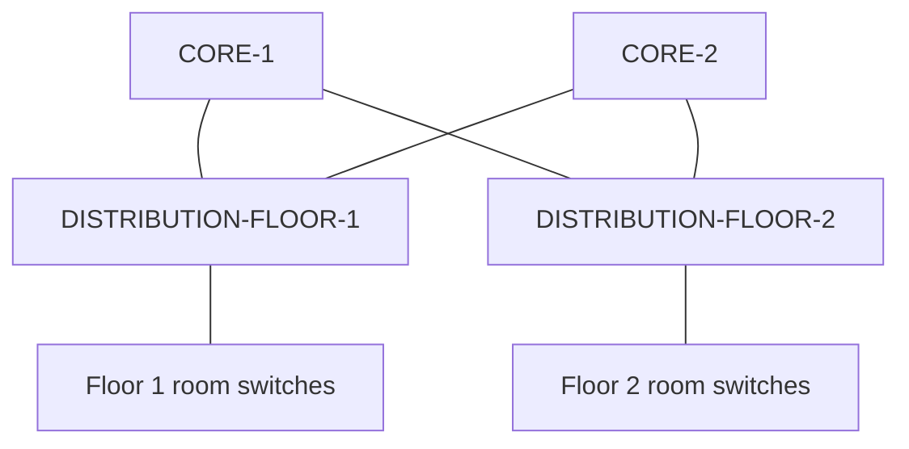

# Three-tier campus network lab

Cisco Packet Tracer simulation of a two-floor campus network. Each floor has one multilayer distribution switch and two room access switches; two multilayer core switches provide separate routed uplinks. This repo records what was configured, what switch output verified, and what is still in progress.

> Current build, September 27–28, 2026. This is simulated equipment, not a production network. The earlier single-switch exercise is preserved in [the archive](archive/single-switch-2026/README.md).

## At a glance

| Area | Current evidence |
| --- | --- |
| Access uplinks | Three-member LACP bundles from each room access switch to its floor distribution switch. Floor 1 distribution showed Po1(SU) and Po2(SU), all members (P), both trunks forwarding VLANs 10,20,30,45,99. |
| VLANs | 10 USERS, 20 VOICE, 30 SERVERS, 45 GUEST, 99 MGMT; native VLAN 99 on the existing access-to-distribution trunks. |
| Core transit | Four routed /30 networks were configured. The initial Floor 2 interface IPs were assigned opposite to the physical core connections. The builder reports correcting the distribution interface IP assignments and then obtaining successful core-to-distribution pings. Initial running configs and failed ping output are preserved; final port/IP output and passing ping transcript have not yet been captured here. |
| Floor gateways | A per-floor SVI address plan and paste-ready commands were provided. No post-change running config or SVI status output has been supplied yet. |
| DHCP/security | The new screenshot shows a server cabled to each distribution. Server IPs, switch ports, pools, relay, snooping, DAI, ACLs, OSPF/static failover, and endpoint tests remain unverified in this recreated topology. |

## Architecture

See [the current screenshot](screenshots/campus-topology-2026-09-28.png), [topology and port map](topology/README.md), and the [address plan](address-plan.md). The access switches are Layer 2; the distribution switches carry the floor VLAN gateways and route toward the two cores. Each distribution has a separate routed link to each core. No EtherChannel spans two independent core switches.

There is **link redundancy inside each three-member access EtherChannel** and two physical routed uplinks per distribution. End-to-end failover is not established until routing and traffic tests prove it. Each floor still has a single distribution switch, so that switch remains a point of failure.

## Evidence and configuration

- [Observed CORE-2 running configuration](configs/core-2-observed.txt)
- [CORE-1 and Floor 1 uplink evidence](configs/core-1-and-floor-1-evidence.md)
- [Room access switch uplink configuration](configs/access-switch-uplinks.md)
- [Observed Floor 2 distribution running configuration](configs/distribution-floor-2-observed.txt)
- [Access bundle and trunk verification](verification/access-uplinks.md)
- [Core transit routes and ARP investigation](verification/core-transit.md)
- [Floor 2 ARP drop investigation](troubleshooting/floor-2-arp-drop.md)
- [New topology screenshot observations](verification/topology-screenshot.md)
- [Proposed SVI and DHCP server-port commands](plans/gateways-and-dhcp-ports.md)

## Next tests

1. Capture `show ip interface brief`, `show cdp neighbors`, `show ip route`, and directly connected core pings from **each** distribution after the IP reassignment, then update the final port map.
2. Confirm the five SVIs per floor are configured and `up/up`, then configure inter-floor routing and test both directions with hosts.
3. Attach DHCP servers on the VLAN 30 server access ports, set static server IPs, define nonoverlapping scopes if both serve the same client networks, and configure `ip helper-address` on remote client SVIs.
4. Only after successful leases and snooping bindings, add DHCP snooping, then DAI on client VLANs. Test permitted and blocked cases, guest ACLs, and a link failure.
5. Export the current Packet Tracer file and a full-frame topology screenshot; the current screenshot shows only part of the access layer.

The earlier lab used 192.168.x subnets and VLANs 25/30/35/45/101/200. Its documents remain in the archive and should not be read as the configuration of this new topology.
