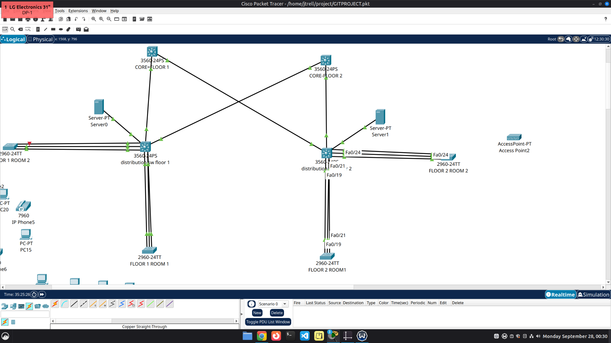

# Three-tier topology and physical port map

- **Core:** two independent Catalyst 3560 multilayer switches, CORE-1 and CORE-2.
- **Distribution:** one Catalyst 3560 per floor, DISTRIBUTION-FLOOR-1 and DISTRIBUTION-FLOOR-2.
- **Access:** two Catalyst 2960 room switches per floor, with three FastEthernet member links per room.
- **Servers and endpoints:** the September 28 screenshot shows one server physically connected to each distribution. The exact port, VLAN, server IP, and DHCP service state are not visible.

The following table is the intended port/IP map. The builder reported that the physical cables were initially connected to different ports, then moved them to match this map; direct pings worked afterward. Capture post-fix `show cdp neighbors` and passing pings as verification.

| Distribution port | Peer core port | Addresses |
| --- | --- | --- |
| FLOOR-1 Gi0/1 | CORE-1 Gi0/1 | 10.255.0.2 ↔ 10.255.0.1/30 |
| FLOOR-1 Gi0/2 | CORE-2 Gi0/2 | 10.255.0.6 ↔ 10.255.0.5/30 |
| FLOOR-2 Gi0/1 | CORE-1 Gi0/2 | 10.255.0.10 ↔ 10.255.0.9/30 |
| FLOOR-2 Gi0/2 | CORE-2 Gi0/1 | 10.255.0.14 ↔ 10.255.0.13/30 |

| Floor distribution ports | Access peer | Port-channel | Trunk |
| --- | --- | --- | --- |
| Fa0/19–21 | Room 1 Fa0/19–21 | Po1, LACP active on distribution and passive on access | dot1q, native 99, allowed 10,20,30,45,99 |
| Fa0/22–24 | Room 2 Fa0/22–24 | Po2, LACP active on distribution and passive on access | dot1q, native 99, allowed 10,20,30,45,99 |

Port-channel numbers are local to each device. Do not bundle links from an access switch to two independent distribution switches into one port-channel. The prior canvas labels used floor-like names for core devices; verify the **CLI hostname, CDP neighbor, and interface IP** before updating the final map. The root cause reported after these initial captures was misplaced physical cables; moving them to the documented ports restored direct pings. The interface IP assignments were not changed. A Packet Tracer file and full-frame topology screenshot remain to be added. The partial screenshot below captures both cores, both distribution switches, both servers, and some access links.

The far-left bundle has a red canvas indicator in this capture. The user identified its Room 2 access switch and supplied `show etherchannel summary`: `Po2(SU)` with Fa0/22(P), Fa0/23(P), and Fa0/24(P). The CLI confirms all three members participate on the access side despite that indicator. Floor 1 distribution Po2 was also previously observed as `SU` with all three members `P`.
