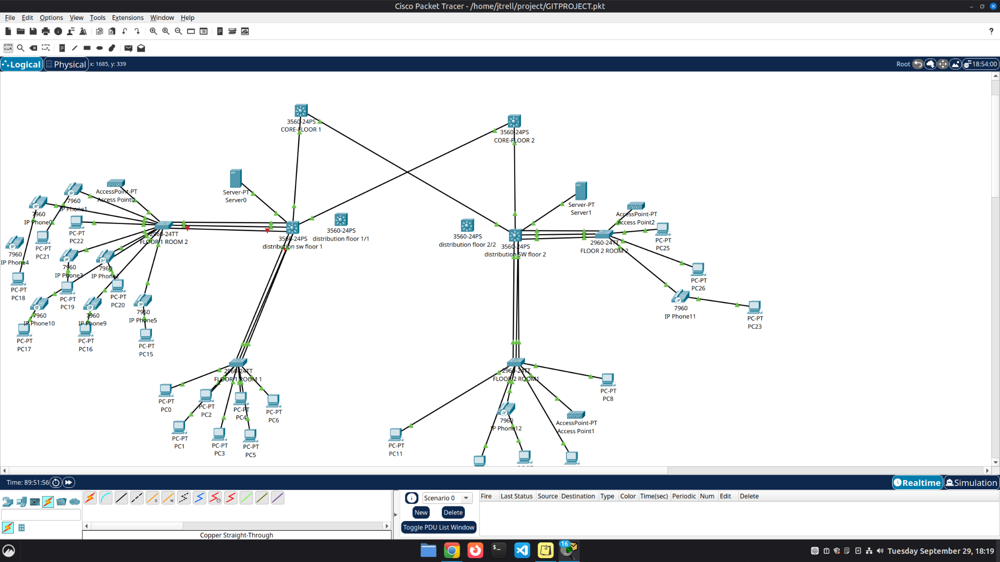

# Campus topology and physical port map

## Device roles

- **Core:** two independent Catalyst 3560 multilayer switches.
- **Distribution:** one working Catalyst 3560 per floor, owning the floor VLAN gateways.
- **Access:** two Catalyst 2960 room switches per floor, connecting PCs and phones.
- **Servers:** one DHCP server per floor, connected to that distribution in VLAN 30.
- **Additional devices:** access points are visible; two unconnected distribution switches are placed as future backup devices.

The capture shows the two cores, two working distributions, all four room switches, two servers, phones, PCs, access points, and the unconnected backup switches. A few lower endpoints are cropped by the Packet Tracer viewport. The screenshot documents device placement and connections; green link indicators alone do not prove protocol operation.

## Routed transit port map

| Distribution port | Core peer port | Distribution IP | Core IP |
| --- | --- | --- | --- |
| FLOOR-1 Gi0/1 | CORE-1 Gi0/1 | 10.255.0.2/30 | 10.255.0.1/30 |
| FLOOR-1 Gi0/2 | CORE-2 Gi0/2 | 10.255.0.6/30 | 10.255.0.5/30 |
| FLOOR-2 Gi0/1 | CORE-1 Gi0/2 | 10.255.0.10/30 | 10.255.0.9/30 |
| FLOOR-2 Gi0/2 | CORE-2 Gi0/1 | 10.255.0.14/30 | 10.255.0.13/30 |

The physical cables initially reached different ports. Moving them to match this table restored direct connectivity without changing the IP assignments.

## Access EtherChannels

| Distribution members | Room switch members | Bundle | Settings in supplied captures |
| --- | --- | --- | --- |
| Fa0/19–21 | Room 1 Fa0/19–21 | Po1 | Distribution active, access passive; native VLAN 99; allowed 10,20,30,45,99 |
| Fa0/22–24 | Room 2 Fa0/22–24 | Po2 | Distribution active, access passive; native VLAN 99; allowed 10,20,30,45,99 |

Each bundle terminates on the same pair of switches. The diagram's core labels are normalized to CORE-1/CORE-2 for clarity; the screenshot uses floor-like core names.

## Future work

Add and configure one backup distribution switch per floor.
